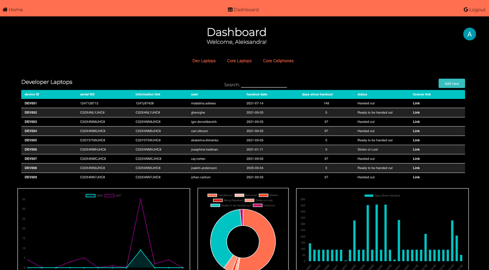

# SALT_Device-Management-System

At the end of our </ SALT > course, we were tasked as a group to create and design an idea for our final project. While brainstorming for ideas, we came upon the :bulb: moment to collaborate with our company and produce a Device Management System to keep track of all their incoming/outgoing devices (laptops, cellphones, etc.) among students & employees. 

The final project consisted of 2 weeks of back-to-back planning and coding between our mob of 3 team members. We predominantly took on a style of mob-programming for the bulk of the infrastructure of the project, then broke off into individual work for smaller components. 

The SALT - Device Management System - is CRUD based software allowing the user to manage all their devices systematically from one place ie. Dashboard. 
No more excel spreadsheets for you, sir! :page_facing_up: :nerd_face:	

Check it out: [SALT_Device-Management-System](https://slap-public.herokuapp.com/)

## Tech Stack (MERN)

#### Front end
* React
* GoogleAuth
* Chart.js

#### Back end
* Node
* Express
* Mongoose (database)
* JWT's

#### Deployment :rocket:
* Front end deployed on Heroku
* Back end deployed on Heroku 

